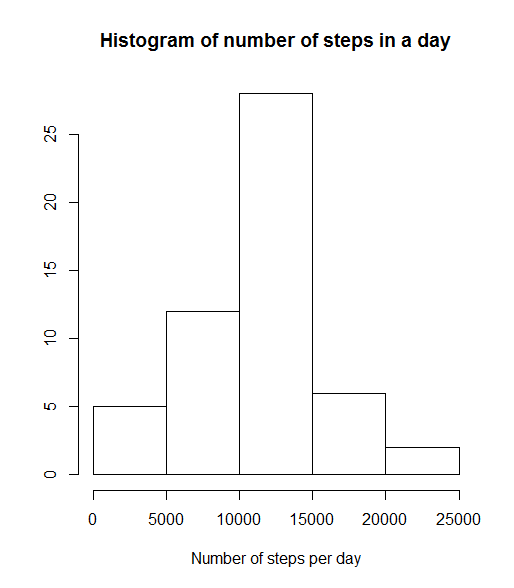
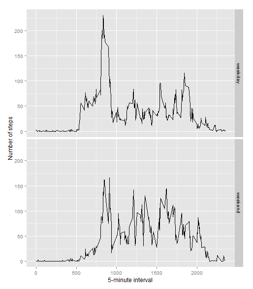

Peer Assessment 1
=================

This is my R markdown file for completing first peer assessment.

Let's start by loading the data

```{r dataload}
act <- read.csv("activity.csv")
```

Creating histogram of the total number of steps taken each day
```{r, fig.height=4}
with(act, hist(tapply(steps, date, sum), xlab="Number of steps per day",
               ylab="", main="Histogram of number of steps in a day"))
```
 

And calculating mean and median of total number of steps taken per day
```{r}
total.steps.mean <- with(act, tapply(steps, date, mean))
total.steps.median <- with(act, tapply(steps, date, median, na.rm=T))
mean.median <- data.frame(total.steps.mean,
                          total.steps.median)
head(mean.median)
```

Checking out on daily activity pattern and concentrating on 5-minute interval
and calculating maximum steps in one day
```{r, fig.height=4}
mean.all <- mean(act$steps, na.rm=T)
averages <- aggregate(x=list(steps=act$steps), by=list(interval=act$interval),
                      FUN=mean, na.rm=TRUE)
plot(averages$steps~averages$interval, type="l", xlab="5-minute interval",
     ylab="Average number of steps taken", main="")
 
max <- averages[which.max(averages$steps),]
max.steps <- max[,2]
```
Maximum average steps in one day was `r max.steps`.


Here is script for calculating number of NA values in taken steps
``` {r}
missing.steps <- is.na(act$steps)
table(missing.steps)
```
 
Filling NAs with mean of its 5-minute interval 

``` {r}
fill.in <- function(steps, interval) {
  fill <- NA
  if (!is.na(steps))
    fill <- c(steps)
  else
    fill <- (averages[averages$interval==interval, "steps"])
  return(fill)
}
filled.data <- act
filled.data$steps <- mapply(fill.in, filled.data$steps, filled.data$interval)
``` 


Changing each day according to wether it is weekday or not. Plotting in same graph how taken steps differ

```{r, fig.height=6}
weekday.or.weekend <- function(date) {
  day <- weekdays(date)
  if (day %in% c("maanantai", "tiistai", "keskiviikko", "torstai", "perjantai"))
    return("weekday")
  else if (day %in% c("lauantai", "sunnuntai"))
    return("weekend")
  else
    stop("invalid date")
}
filled.data$date <- as.Date(filled.data$date)
filled.data$day <- sapply(filled.data$date, FUN=weekday.or.weekend)

averages <- aggregate(steps ~ interval + day, data=filled.data, mean)
library(ggplot2)
ggplot(averages, aes(interval, steps)) + geom_line() + facet_grid(day ~ .) +
  xlab("5-minute interval") + ylab("Number of steps")
```
 
 


